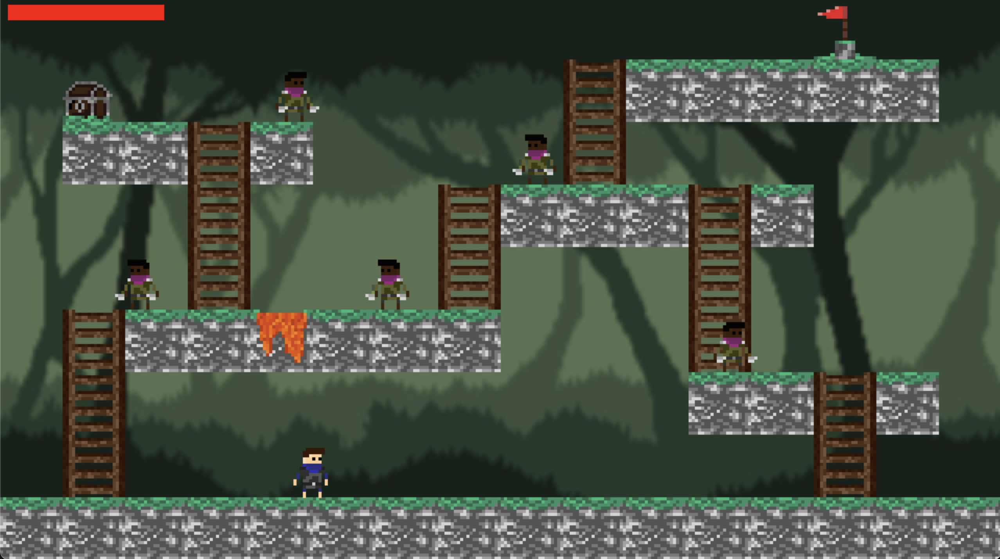

# BasicPlatformer-SDL2

This is my second experimental version of an SDL2 game. It's a platformer where you kill enemies and try to reach the end. Set in a jungle with bloodthirsty natives, your goal is to find your way back home.

## Requirements

- SDL2 (installed with brew)
- SDL2_image (installed with brew)
- Makefile

## Install requirements

```bash
brew install sdl2
brew install sdl2_image
```

## Run

```bash
make
```

## Controls

w - up  
d - down  
a - right  
d - left

lshift - sprint  
space - jump

attack1 - e  
attack2 - q

interact - f  
inventory - i

## Example



## Supports

- MacOS